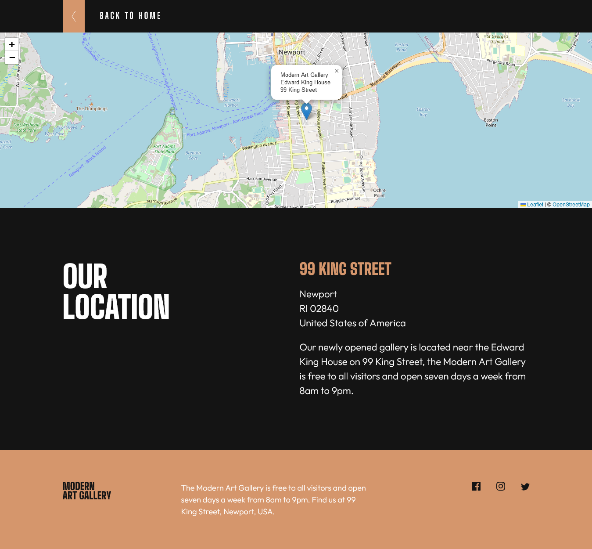
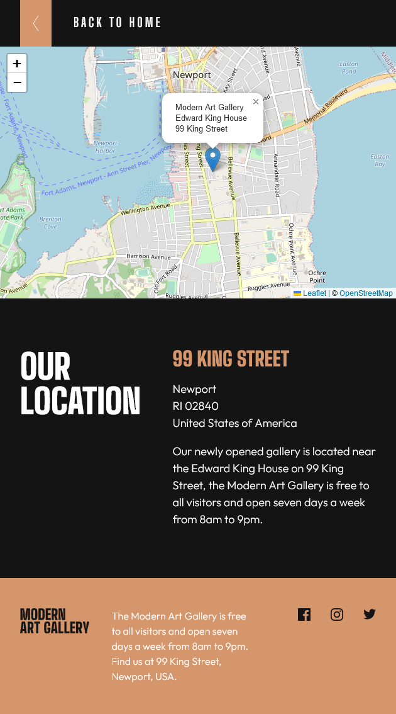
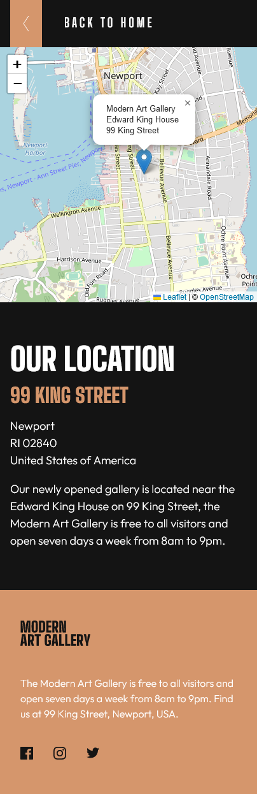

# Frontend Mentor - Art gallery website solution

This is a solution to the [Art gallery website challenge on Frontend Mentor](https://www.frontendmentor.io/challenges/art-gallery-website-yVdrZlxyA). Frontend Mentor challenges help you improve your coding skills by building realistic projects.

## Table of contents

- [Frontend Mentor - Art gallery website solution](#frontend-mentor---art-gallery-website-solution)
  - [Table of contents](#table-of-contents)
  - [Overview](#overview)
    - [The challenge](#the-challenge)
    - [Screenshot](#screenshot)
    - [Links](#links)
  - [My process](#my-process)
    - [Built with](#built-with)
    - [The picture element](#the-picture-element)
  - [Author](#author)

## Overview

### The challenge

Users should be able to:

- [x] View the optimal layout for each page depending on their device's screen size
- [x] See hover states for all interactive elements throughout the site
- [x] **Bonus**: Use [Leaflet JS](https://leafletjs.com/) to create an interactive location map with custom location pin

### Screenshot


<details>
  <summary><b>Index Tablet View</b></summary>
  
</details>

<details>
  <summary><b>Index Mobile View</b></summary>
  
</details>

<details>
  <summary><b>Location Desktop View</b></summary>
  
</details>

<details>
  <summary><b>Location Tablet View</b></summary>
  
</details>

<details>
  <summary><b>Location Mobile View</b></summary>
  
</details>

### Links

- Solution URL: [Add solution URL here](https://your-solution-url.com)
- Live Site of [Modern Art Gallery challenge.](https://matondo99.github.io/art-gallery-website/)

## My process

### Built with

- Semantic HTML5 markup
- CSS custom properties
- Flexbox
- CSS Grid
- Mobile-first workflow

### The picture element

```html
<picture>
  <source
    media="(min-width: 880px)"
    srcset="
      images/desktop/image-hero.jpg    1x,
      images/desktop/image-hero@2x.jpg 2x
    "
  />
  <source
    media="(min-width: 570px)"
    srcset="images/tablet/image-hero.jpg 1x, images/tablet/image-hero@2x.jpg 2x"
  />
  
</picture>
```

## Author

- Website - [Astar Bahouidi](https://github.com/Matondo99)
- Frontend Mentor - [@Matondo99](https://www.frontendmentor.io/profile/Matondo99)
